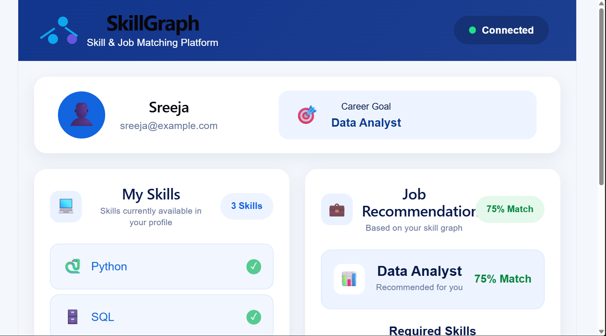
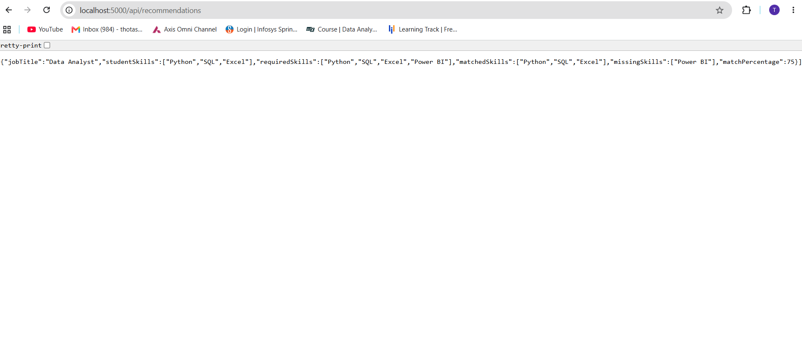
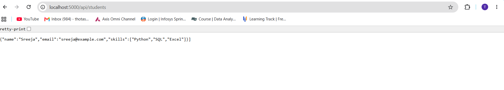
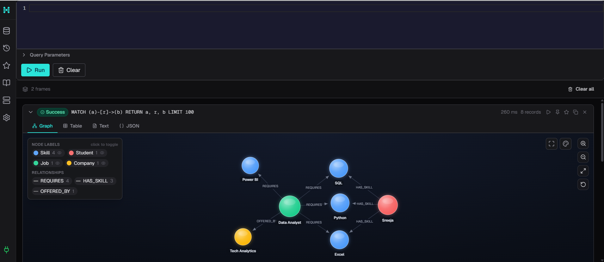

# SkillGraph - Skill & Job Matching Platform

SkillGraph is a full-stack web application that helps students understand how their current skills match with job requirements.
## Live Demo

🚀 **Live Application:** https://skillgraph-frontend-scx4.onrender.com

The application is deployed on Render and connected to a Node.js/Express backend with CognoDB as the graph database.

The application connects a React frontend with a Node.js and Express backend and uses CognoDB as a graph database to store relationships between students, skills, jobs, and companies.

The system identifies matching skills, missing skills, calculates a job match percentage, and provides a skill-learning recommendation.

---

## Project Overview

Finding the right job can be difficult for students and fresh graduates because they may not know:

- Which jobs match their current skills
- Which required skills they already have
- Which skills they are missing
- What skills they should learn next

SkillGraph solves this problem by connecting students, skills, jobs, and companies using a graph database.

---

## Features

- Student profile display
- Dynamic student skills
- Job recommendation
- Skill matching
- Match percentage calculation
- Matched skill identification
- Missing skill identification
- Skill gap recommendation
- Backend connection status
- Loading state
- Responsive dashboard

---

## Technology Stack

### Frontend

- React.js
- JavaScript
- HTML5
- CSS3
- Vite

### Backend

- Node.js
- Express.js
- REST API
- CORS
- dotenv

### Database

- CognoDB
- Neo4j Driver
- Cypher Query Language

### Tools

- Visual Studio Code
- Git
- GitHub
- Postman
- npm

---


## Screenshots

### SkillGraph Dashboard



### Job Recommendations



### Student Data



### CognoDB Graph Database




## System Architecture

```text
┌─────────────────────────────┐
│       React Frontend        │
│        localhost:5173       │
└──────────────┬──────────────┘
               │
               │ REST API
               ▼
┌─────────────────────────────┐
│     Node.js + Express       │
│        localhost:5000       │
└──────────────┬──────────────┘
               │
               │ Neo4j Driver
               │ Cypher Queries
               ▼
┌─────────────────────────────┐
│          CognoDB            │
│       Graph Database        │
└─────────────────────────────┘
---

## Graph Database Model

SkillGraph represents relationships between students, skills, jobs, and companies.

```text
Student
   │
   │ HAS_SKILL
   ▼
Skill
   ▲
   │ REQUIRES
   │
Job
   │
   │ OFFERED_BY
   ▼
Company

For the current sample data:
Sreeja
   │
   ├── HAS_SKILL ──> Python
   ├── HAS_SKILL ──> SQL
   └── HAS_SKILL ──> Excel


Data Analyst
   │
   ├── REQUIRES ──> Python
   ├── REQUIRES ──> SQL
   ├── REQUIRES ──> Excel
   └── REQUIRES ──> Power BI


Data Analyst
   │
   └── OFFERED_BY ──> Tech Analytics

   How Skill Matching Works

The current student has:

Python
SQL
Excel

The Data Analyst job requires:

Python
SQL
Excel
Power BI
Matched Skills
Python
SQL
Excel
Missing Skill
Power BI
Match Percentage
Matching Skills = 3
Required Skills = 4


Match Percentage = (3 / 4) × 100


Match Percentage = 75%

The dashboard then recommends:

Learn Power BI to improve your job match.
API Endpoints
Backend Health Check
GET /

Checks whether the backend can successfully connect to CognoDB.

Example response:

{
  "success": true,
  "message": "SkillGraph database connected successfully!"
}
Get Students
GET /api/students

Returns student information and their skills.

Example:

[
  {
    "name": "Sreeja",
    "email": "sreeja@example.com",
    "skills": [
      "Python",
      "SQL",
      "Excel"
    ]
  }
]
Get Recommendations
GET /api/recommendations

Returns the recommended job and skill matching information.

Example:

[
  {
    "jobTitle": "Data Analyst",
    "studentSkills": [
      "Python",
      "SQL",
      "Excel"
    ],
    "requiredSkills": [
      "Python",
      "SQL",
      "Excel",
      "Power BI"
    ],
    "matchedSkills": [
      "Python",
      "SQL",
      "Excel"
    ],
    "missingSkills": [
      "Power BI"
    ],
    "matchPercentage": 75
  }
]
Seed Sample Data
POST /api/seed

Creates the sample SkillGraph data in CognoDB.

The seed data contains:

Student: Sreeja
Skills: Python, SQL, Excel, Power BI
Job: Data Analyst
Company: Tech Analytics
Project Structure
SkillGraph/
│
├── frontend/
│   ├── src/
│   │   ├── App.jsx
│   │   ├── App.css
│   │   └── main.jsx
│   │
│   ├── package.json
│   └── vite.config.js
│
├── backend/
│   ├── server.js
│   ├── package.json
│   └── .env
│
├── README.md
└── ...
Backend Setup

Go to the backend folder:

cd backend

Install dependencies:

npm install

Create a .env file inside the backend folder.

Add your CognoDB connection details:

COGNODB_URI=your_cognodb_uri
COGNODB_USERNAME=your_cognodb_username
COGNODB_PASSWORD=your_cognodb_password
PORT=5000

Do not upload the .env file to GitHub.

Start the backend:

npm start

The backend runs on:

http://localhost:5000

For development with Nodemon:

npm run dev
Frontend Setup

Open another terminal.

Go to the frontend folder:

cd frontend

Install dependencies:

npm install

Start the React application:

npm run dev

The frontend normally runs on:

http://localhost:5173
Running the Application

You need to run both the backend and frontend.

Terminal 1 - Backend
cd backend
npm install
npm start
Terminal 2 - Frontend
cd frontend
npm install
npm run dev

Then open:

http://localhost:5173
Dashboard

The SkillGraph dashboard contains two main sections.

My Skills

Displays the student's current skills.

Example:

Python
SQL
Excel
Skill Strength

Displays the current job skill match percentage.

Example:

75%
Job Recommendation

Displays the recommended job.

Example:

Data Analyst
75% Match
Required Skills

Shows matched and missing skills.

✓ Python
✓ SQL
✓ Excel
⚠ Power BI
Skills to Learn

Shows the number of missing skills.

Example:

1 Skill to Learn
Recommendation

Provides an actionable recommendation.

Learn Power BI to improve your job match.
Error Handling

The application checks the backend connection when it starts.

If the backend is connected:

Connected

If the backend is unavailable:

Disconnected

The frontend also handles loading and unavailable recommendation data.

Security

Database credentials are stored in environment variables.

The .env file should not be uploaded to GitHub.

Add the following to .gitignore:

node_modules/
.env

Never commit:

Database passwords
API keys
Authentication tokens
.env files
Future Enhancements

Possible future improvements include:

Multiple student profiles
Multiple job recommendations
Company recommendations
Resume upload
Automatic skill extraction
Skill similarity analysis
Learning resource recommendations
Job ranking
User authentication
Job application tracking
Interactive graph visualization
Cloud deployment
Project Objective

The main objective of SkillGraph is to demonstrate how a graph database can be used in a full-stack application to connect student skills with job requirements.

The application provides a simple career guidance flow:

Current Skills
      ↓
Job Requirements
      ↓
Skill Matching
      ↓
Missing Skills
      ↓
Match Percentage
      ↓
Learning Recommendation
Example Result
Student: Sreeja


Current Skills:
Python
SQL
Excel


Recommended Job:
Data Analyst


Required Skills:
Python
SQL
Excel
Power BI


Matched Skills:
Python
SQL
Excel


Missing Skills:
Power BI


Match Percentage:
75%


Recommendation:
Learn Power BI to improve your job match.
Author

Thota Sreeja

MCA - Vivekananda Degree & PG College, Hyderabad
